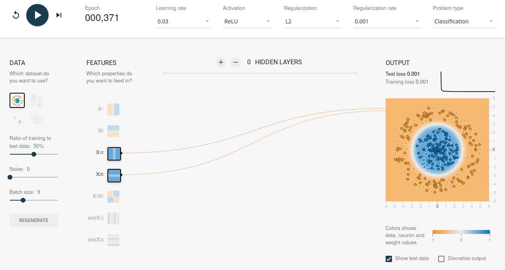

# Learning to learn with TensorFlow playground (spoilers ahead!)

## Introduction to tensor-flow playground
[The tensor-flow playground](https://playground.tensorflow.org/) is a wonderful tool to experiment with simple neural nets.

Given a small number of problems in 2-dimensions $(x1, x2)$,
you're asked to design a good classifier / regressor model that will
correctly classify the output value of every point in input space
by tinkering with various model parameters.

Model parameters you can control are:

  - Which initial input features are fed into the network
  - Model complexity or capacity to learn:
    - Number of hidden-layers in the network
    - Number of nodes in each hidden-layer
  - Choice of activation function (ReLU, tanh, sigmoid, linear)
  - Learning rate
  - Regularization type (L1, L2) and rate
  - Size of each mini-batch
  - Ratio of test to train examples in each minibatch
  - Level of added noise

Making the right model-design decisions by picking optimal values
for the above parameters can result in dramatic differences
in final model quality.

The challenge is to create the best model possible for each of the problems
presented.

***Note:*** these are spoilers. A set of "cheats" for near perfect
solutions. You're encouraged to try and
[solve the problems yourself](https://playground.tensorflow.org/),
before looking at the solutions below.

## Problem #1: a trivial classifier in 2D

The simplest problem in the set is to classify/separate
two diagonally opposite clusters in two dimensions $(x1, x2)$

Challenge: design a learner that will separate the two
classes (orange vs blue dots) in an optimal way.

With the right input-features & parameter choices we are
able to get a perfect classifier, very quickly. Here is the 1st solution:

The two clusters are clearly and directly linearly-separable
in the original input space.

***Notes:***

  - There's no need to transform any original feature
  - Less is more: two input-features (`x1`, `x2`) are sufficient for a perfect solution. We can completely ignore all the other five input-features. They don't contribute added value to the 1st two input-features.
  - There's no need for hidden-layers: the input and output layers can be directly connected
  - We can learn fast, using a high learning-rate without fear of overfitting

## How can we tell we have a good model?

  - At the top right of the screenshot there's a learning curve: loss over time
    - Both learning curves (train & test) overlap (agree with each other) over time
    - The curve is L-shaped: it drops sharply and quickly towards near zero loss very early in the process
    - We see no upward-spikes in the learning curves
    - The final test loss is lower than train loss; this is very unusual/rare. It indicates that our model is not too complex nor too simple and has great generalization power.
  - In the output, the right-side square image, the **boundary** between the orange and blue clusters is smooth & clear:
    - It lies half-way between the closest points in the two sets (the support vectors)
    - Its orientation (from corner to corner) is nearly perfect and perpendicular to the line between the closest-points _and_ the cluster centroids.

Looking deeper: the identity `x1 == -x2`, i.e. the down-sloping diagonal
of the plane, is the perfect class separator (hyperplane in
general multi-dimensional terms). This is the reason why (`x1`, `x2`)
are the only features required for a perfect classifier.

## Problem #2: 2-pairs of clusters with x1, x2 overlap

Continuing with the 2nd simplest problem, 4-clusters with `(x1, x2)`
overlap.

Again, the clusters are clearly separable in the original input space,
But the boundary is more complex since we now have 4 instead of 2
clusters, where each pair of same-color clusters lies along one of the
diagonals.

We need two lines, one horizontal and one vertical to achieve the separation.

The choice of the input feature is critical: keeping the original
input features (`x1, x2`) results in a complete inability to learn.
The learning curves are moving sideways rather than dropping and
converging towards zero as can be seen here. The loss is close to 0.5
meaning (binary) classification is wrong about half the time. It is
as good as a random guess.

We could "add capacity" (complicating the model) by adding
hidden-layers. This allows the training to converge
to a (near zero loss) solution, but this solution is far from optimal:

***How can we tell the solution isn't optimal?***

  - The test-loss is _much_ higher than the training-loss (0.018 vs 0.003)
  - While training, we can see the train error leading down with test-loss not being able to keep up
  - The class-boundaries are not as we expect them (along the 4 quadrants): note the rhombus (instead of square) shape of the upper-right quadrant.
  - Over-fitting is in effect: whenever we click on the "regenerate" button (creating slightly different data-sets) the boundaries of the model shift. This tells us that the [generalization error](https://en.wikipedia.org/wiki/Generalization_error) is poor. IOW: the expected out-of-sample error is large.
  - The hidden-layers (partial solutions):
    - Have a lot of overlaps/redundancies between them
    - Are not optimally oriented (vertically, horizontally, diagonally) like the original classes

Realizing that the best and most-relevant input feature is the
multiplicative feature instead of the original coordinates,
we switch from the two original coordinates (`x1, x2`)
to a _single_ multiplicative input feature (`x1 * x2`).
This projection of the input space to a new coordinate system
perfectly describes the 4-quadrant mapping into the two diagonal sets,
and results in a near perfect solution without any need for hidden-layers.
The model classifies correctly and generally, even though it is much simpler:

***Again, we can tell we have a good model because:***

  - We have near zero losses on both train and test sets after less than 500 iterations
  - There's no need for hidden-layers (minimalism)
  - Convergence to the solution is both fast and smooth
  - The test and training loss are running close during training, and end-up equal to each other at the end

***Note:*** because the boundaries between the clusters are much
narrower, choices of smaller values for both the learning &
regularization rates are needed here.

We see again that the choice of input feature(s) proves to be the most
critical choice we have to make in order to achieve a good solution.

## Problem #3: Concentric Circles

What if our two sets of dots are not simply/linearly separable?

Consider the case of two concentric set of points.

Trying to separate the two sets with straight lines won't work well.

As
[René Descartes](https://en.wikipedia.org/wiki/Ren%C3%A9_Descartes)
(1596 - 1650) already knew, the formula for a circle in Euclidean
2D space is $x^2 + y^2 = R^2$  where $R$ is the radius of the circle
whose center is at the origin. The cartesian coordinate system
is named after Descartes.

This provides the critical insight on how to solve this particular
classification problem perfectly, and in a minimalistic way.

Again, there's no need for hidden-layers, although we could come up
with many solutions by adding inputs and capacity, they wouldn't
be perfect, nor minimal (in the model-simplicity sense).

The most relevant & strongest input features are: $x1^2$ and $x2^2$.
Once the sum $x1^2 + x2^2$ exceeds a certain threshold, we have
switched class from blue to orange.

Here's the optimal solution which relies on Descartes circle formula.

## Problem #4: Concentric, interleaved Spirals

Unlike in the previous 3 problems, an optimal solution to the
4th & most difficult classification problem in this set,
is harder to come by.

There's no subset of input features available in the UI,
that can lead to a smooth boundary between the two interleaved spirals.

This forces us to try and construct a good separating boundary
out of many disjoint linear local functions. The only way to do this
with the given input features is to increase capacity, i.e. adding
hidden-layers. These layers lead to approximate functions to transform
the input into the desired output. IOW: they increase model complexity.

In particular, it is hard to get to a good solution without making
some earlier hidden-layers wider than the input layer itself.
The purpose of making early layers wider, is to try and generate
stronger early cross-features by combining the original features
in many possible different ways.

Here's a solution that is deceiving: the final loss is a very low
test loss of 0.001. Yet it is obvious that the model is bad (try to
see why before continuing):

***A few red-flags are tell-tell signs of over-fitting:***

  - The boundary between the classes:
    - Is not smooth: it has many bumps and irregularities
    - It is not equi-distant from the two classes. In some locations it almost touches the data-points while in others, it is far-away from the nearest class
  - Some of the nodes in the hidden-layers are almost pure white. This indicates
    - Excess capacity / redundancy
    - Low contribution of these nodes to the final solution
  - The ratio of training to test data is too high (80%) leaving insufficient data for out-of-sample generalization
    - When the test set is too small, it is much easier to get a low (by chance) test-loss because the small number of test data-points just happens to agree with the 80% training majority.
  - The loss convergence curve has spikes & sudden jumps.
    - Inability to converge is notable especially near the end
    - The loss-spikes seem to get larger during the last 1/3rd of the training time

Given the above, it seems very likely that training was stopped
at a particular iteration when the test-loss dropped
_by random chance_ to 0.001.

Here is a _much better_ solution.  Despite the misleadingly high final loss
(0.021), the boundary is much smoother an equi-distant from the two classes:

***Unlike in the previous solution:***

  - The ratio of training to test data is much better (divided 50%, 50%)
  - The final test & train losses are equal (0.021)
  - The train & test loss convergence curves are closer to each other and more consistent
  - We see almost no loss spikes along the learning loss curves
  - There are no near white hidden-layer nodes. While a few are whiter than others, they seem to still contribute to the overall solution
  - Early weights (links between nodes) are very uniform in their color

All the above indicate that this model has a good (low) expected
generalization error.

### Coordinate projections

Would it be possible to get a model that is as perfect as the ones
we got in the 1st 3 classification problems?

Yes, and representation is paramount. If we could project
the original cartesian coordinates `(x1, x2)` into
[polar coordinates](https://en.wikipedia.org/wiki/Polar_coordinate_system)
 $(r, \phi)$:

  - $r$ - distance from the origin
  - $\phi$ - angle from the positive side of the X-axis

and add these to the allowed input features we would be in a much
better starting position to easily separate the two entangled spirals.

This is reminiscent of the
[kernel-trick](https://en.wikipedia.org/wiki/Kernel_method#Mathematics:_the_kernel_trick) in
[SVM (Support Vector Machines)](https://en.wikipedia.org/wiki/Support-vector_machine)
where projecting a two-class data-set in N-input-dimensions, into a
higher-dimensional space, often makes the classes more easily separable.

## Going beyond coordinate projections

Other ideas could make the solution converge even smoother & faster:

  - Combine/cross the polar-coordinates with periodic-features: $(sin(r), sin(\phi))$
  - Automatically drop-out redundant (almost white) nodes would help avoid irrelevant noise
  - Being able to draw "attention": short circuit early spiral-detecting nodes, to later layers skipping layers that may randomly attenuate and perturb the best signals.

All of these are effective, and by now pretty common, techniques
to learn more effectively in deep-learning.

## Summary table: how to improve models

| Problem          | Symptom/red-flag           | Possible Solutions       |
|:-------------    |:-------------------------- |:------------------------ |
| Under-fitting    | <li>Slow/no loss convergence:   <li>loss-curve going sideways                                                     |  <li>Add relevant/better features  <li>Add training data  <li>Decrease regularization  <li>Increase model capacity  <li>Increase learning rate   |
| Over-fitting     |  <li>Gap between train & test loss  where train-loss is lower  <li>Spikes in loss-curve  <li>Irregular inter-class boundary  <li>Non equi-distant class boundary                                   |  <li>Add test data  <li>Increase regularization  <li>Decrease model capacity   <li>Decrease learning rate   |

## Summary: indicators of good models

  - Low final train and test loss
  - Convergence speed: loss (both train & test)
    - Decreasing early & fast
    - Gradually leveling out as convergence to near-zero takes place
  - Smoothness of the learning curve: no spikes, smooth convergence
  - Train vs test gap: no big gap, test closely follows train loss downwards
  - Clean boundaries between classes:
    - No bumps & irregularities
    - Boundaries are equi-distant from opposite-class closest points
  - Right amount of capacity/complexity:
    - No "all-white" nodes
    - Uniform weights in early layers (all features contributing nearly equally to the solution)

## Closing thoughts

The bigger a neural-net is, the more complex the model and the slower
it will take to learn (converge the loss towards acceptable low levels).

The best shortcut to a great model is the relevancy of the inputs.

If you can pre-process, project or otherwise transform inputs into
more relevant features do that first.

Once you have good input features, focus on the derived/computed
(inside the network) features. Use the breakthrough in ML/AI (2017):

  - Switch NN architecture to use transformers!
  - Add RLHF (Reinforcement Learning via Human Feedback)

Of course, many problems have no trivial solutions which means these
shortcuts cannot be taken. In that case, there's no escape from
brute-forcing the data, and guarding against overfitting at every
local boundary.

Essentially, any large-capacity model, is a collection of a large number
of piece-wise local near-linear boundaries between classes.
In essence, complex models with millions or billions of parameters,
simply memorise their data well.

Adding capacity by complicating models have an exponentially
growing cost. There's no escape from the
[curse-of-dimensionality](https://en.wikipedia.org/wiki/Curse_of_dimensionality). Such models learn the data they've seen, but real generalization
into the exponentially larger input and solution spaces is not
actually achieved.

We seem to still be pretty far away from achieving AGI (Artificial General
Intelligence), using current techniques. OTOH: the most recent advances
in AI, especially: transformers & Large Language Models (LLMs)
are providing new hopes for a breakthrough. There's also a risk
AGI is a double-edged sword, and it could be misused.
